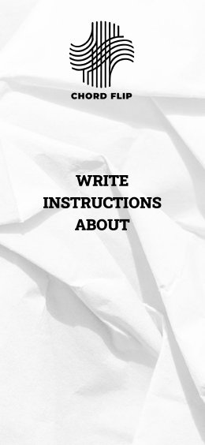
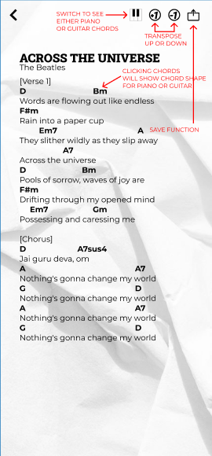
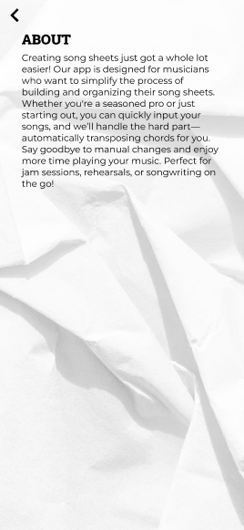

# Chordflip

## Overview

Chordflip allows users to simply input chords into song lyrics and be able to transpose chords conveniently

### Problem Space

Wether you are a new musician or a seasoned veteran, at some point you've had to create your own song sheet. There are a bunch of songsheet creator websites out there however, you would have to download an app or pay premiums to access the feature. Chordflip aims to make songsheet creation as easy as possible without all the hassle of signing up, downloading apps and more importantly it's free!

### User Profile

Musicians - Regardless of skill level - Looking to easily create songsheets - Easily transpose chords to different keys

### Features
- Users can easily type song lyrics
- Users can input chords on top of song lyrics
- All chords are transposable to a half step using + and - buttons
- Once user is done creating the chord sheet, they can download it as a PDF
- ?? Chords will automatically be set to bold ?? (Not sure how to implement this yet)

## Implementation

### Tech Stack

- React
- Express
- Client libraries:
  - react
  - react-router
  - axios
  - jsPDF (allows users to generate PDFs after creating chords)
- Server libraries:
  - express

### APIs

- https://piano-chords.p.rapidapi.com

### Sitemap

- homePage - main landing page
- writePage - notepad style text area where users type in the lyrics and chords
- instructionsPage - basic instructions on how to use the app
- aboutPage - stuff about app

### Mockups






### Data

n/a

### Endpoints

**GET /chords**

- Get chords list

Response:

```
{
    "C": {...
    },
    "C#": {...
    },
    "D": {...
    },
    ...
}
```

**GET /chords/c**

- Get variations for specific chord

Parameters: - {chord} (C, C#, D, Eb, ...)

Response:

```
{
    "major": {...
    },
    "m": {...
    },
    "dim": {...
    },
    ...
}
```

**GET /chords/c/major**

- Get info on chord variation

Parameters: - {chord} (C, C#, D, Eb, ...) - {variation} (major, m, dim, 7, ...)

Response:
{
"name": "C-major",
"notes": [
"C",
"E",
"G"
],
"intervals": [
"1",
"3",
"5"
],
"midiKeys": [
60,
64,
67
]
}

**PUT /chords/{chord}/{variation}/generate-graphic**

- Generates dynamic chord shape graphics when a user clicks on a chord
- Can be used for piano or guitar

Parameters: - {chord} (C, C#, D, Eb, ...) - {variation} (major, m, dim, 7, ...) - {instrument} (guitar, piano)

## Roadmap

- Create client side

  - link to new github repo
  - whole front end with routes

- Setup back end API

  - link to new github repo
  - setup API routes
    - GET /chords, GET /chords/{chord}, etc...

- Feature: Chords

  - Setup Chords to automatically be bold when typed
  - Create transpose functions

- Pre-launch: Testing

- Bug fixes

- Deploy

## Future Implementations

- Feature: Chord chart

  - Create PUT /chords/{chord}/{variation}/generate-graphic endpoint
  - Integrate to front-end

- Add sound to each chords/notes when clicking chords
- Add rhymes page so users can conveniently enter words and rhyming words would populate
